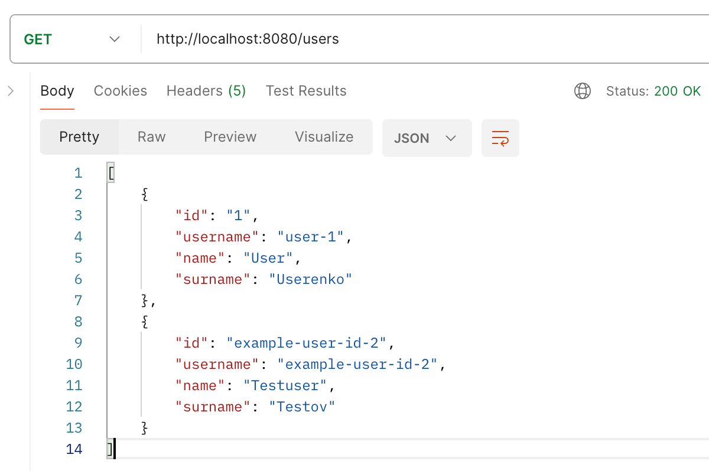

user-aggregation
===============
type: restapi

description: Service for user aggregation from different databases

server-port: 8080

Pull Postgres image:
    docker pull postgres

Run Postgres container:
    docker run --name postgres -e POSTGRES_USER=testuser -e POSTGRES_PASSWORD=testpass -d -p 5432:5432 postgres

Run scripts inside Postgres container: 
    init-database1.sql  
    init-database2.sql

Building info:
    mvn clean package

Run UserAggregationApplication:
    GET: http://localhost:8080/users

Request example:
